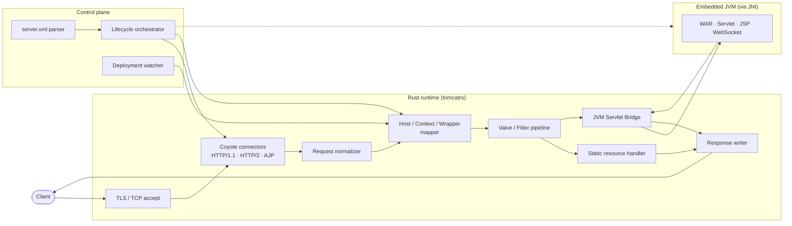

# Tomcat-RS Compatibility Runtime

*An incremental Rust rewrite of Apache Tomcat that keeps your existing Java WARs running.*

[](https://github.com/nktkt/Michael/releases/latest)
[](LICENSE)
[](rust-toolchain.toml)
[](#testing)
[](https://tomcat.apache.org/)
[](#tomcat--java-targets)

> The GitHub repository for this project is named **Michael**
> (`https://github.com/nktkt/Michael`). "Tomcat-RS Compatibility Runtime"
> is the project name; "Michael" is just the repo name.

**Status: v1.0.0 — first stable release.** Production compatibility with stock
Tomcat 11.0.x is the explicit goal of this line; the runtime is exercised by
**848 passing tests** across 32 binaries, a differential-testing harness, a
fuzz suite, and a security conformance suite. See
[`docs/release-notes-1.0.0.md`](docs/release-notes-1.0.0.md) for a tour of
what's new, and the "What's still partial in 1.0.0" section below for honest
caveats.

---

## Why

Apache Tomcat is often described as "a web server," but that undersells it.
Tomcat is a **Jakarta container**: it implements the Jakarta Servlet,
Jakarta Pages (JSP), Jakarta Expression Language (EL), and Jakarta WebSocket
specifications. Real applications depend on Servlet API semantics, on Jasper
compiling JSPs, on `web.xml` wiring, on Java classloader isolation, and on
listener/filter lifecycles. A naive "pure Rust rewrite" would throw all of
that away and break every existing WAR on day one.

So this project takes a deliberately **hybrid** approach:

- Reimplement the **dangerous, I/O-heavy, parser-heavy, control-plane** layers
  in Rust — the parts where Rust's memory safety, performance, and modern
  async networking pay off the most.
- **Keep Servlet / JSP / EL execution on an embedded JVM**, reached through a
  JNI bridge (the `tomcatrs-servlet-bridge` crate). The JVM remains the source
  of truth for Servlet API compatibility, Jasper, Jakarta EL, and Java
  classloader semantics.

The result: the attack surface and the hot networking path move to Rust, while
binary compatibility with the Java ecosystem is preserved.

### Rust side vs JVM side

| Concern | Rust side | JVM side |
| --- | --- | --- |
| TLS / TCP accept loop | ✅ | |
| HTTP/1.1, HTTP/2, AJP connectors (Coyote) | ✅ | |
| Request line / header / cookie parsing & normalization | ✅ | |
| URI hardening (path traversal, encoded slash, etc.) | ✅ | |
| Host / Context / Wrapper mapper (routing) | ✅ | |
| `server.xml` parsing & validation | ✅ | |
| Lifecycle orchestration (Server→Service→…→Wrapper) | ✅ | |
| Deployment watching / auto-deploy | ✅ | |
| Static file serving | ✅ | |
| Access logs, metrics, observability | ✅ | |
| Session storage backends (memory / file / cluster) | ✅ | |
| Clustering / replication transport | ✅ | |
| Servlet API execution | | ✅ |
| Filters, Listeners, `web.xml` wiring semantics | invoked from Rust | ✅ |
| Jasper / JSP compilation & runtime | | ✅ |
| Jakarta Expression Language | | ✅ |
| Java classloader isolation per webapp | | ✅ |
| WebSocket transport | ✅ | endpoint logic ✅ |
| Manager API / health / JMX bridge / OTel export | ✅ | |
| Security: auth, realms, constraints, hardening valves | ✅ | |

---

## Architecture



The data-plane path (top) carries request/response traffic. The control-plane
path (bottom) parses configuration, drives the lifecycle state machine, and
watches `appBase` for deployments.

---

## Workspace layout

This is a Cargo workspace. Crates live under `crates/`:

```
Michael/
├── Cargo.toml                       # workspace manifest
├── crates/
│   ├── tomcatrs-core                # shared types, errors, lifecycle traits, component model
│   ├── tomcatrs-config              # server.xml / web.xml / catalina.properties parsing
│   ├── tomcatrs-coyote              # connectors: HTTP/1.1, HTTP/2, AJP, request/response codec
│   ├── tomcatrs-catalina            # container engine: Engine/Host/Context/Wrapper, valves, mapper
│   ├── tomcatrs-webapp              # webapp model, deployment, static resources, web.xml binding
│   ├── tomcatrs-servlet-bridge      # JNI bridge to the embedded JVM (Servlet/JSP/EL execution)
│   ├── tomcatrs-jsp                 # JSP/Jasper bridge glue and compilation orchestration
│   ├── tomcatrs-session             # session manager + memory/file/Redis/JDBC/cluster stores
│   ├── tomcatrs-security            # auth (BASIC/DIGEST/FORM), realms, constraints, request limits, URI hardening
│   ├── tomcatrs-websocket           # WebSocket handshake, frame codec, transport, Jakarta bridge
│   ├── tomcatrs-observability       # access logs, metrics, tracing, health, JMX bridge, OTel export
│   ├── tomcatrs-cli                 # `tomcatrs` binary: run / check-config / version
│   └── tomcatrs-compat-tests        # differential test harness against stock Tomcat
├── conf/                            # sample server.xml, web.xml, catalina.properties
├── webapps/                         # default webapp root (ROOT/)
├── docs/                            # architecture, compatibility, release notes
├── fuzz/                            # cargo-fuzz targets for parsers and connectors
└── tests/                           # compatibility / protocol / security / migration tests
```

| Crate | Responsibility |
| --- | --- |
| `tomcatrs-core` | Shared types, error model, the lifecycle trait, and the component model contracts. |
| `tomcatrs-config` | Parses and validates `server.xml`, `web.xml`, and `catalina.properties`. |
| `tomcatrs-coyote` | The Coyote layer: connector implementations and the HTTP/1.1, HTTP/2, and AJP codecs. |
| `tomcatrs-catalina` | The Catalina container: Engine/Host/Context/Wrapper, valve pipeline, and the request mapper. |
| `tomcatrs-webapp` | Webapp representation, deployment/auto-deploy, static resource serving, `web.xml` binding. |
| `tomcatrs-servlet-bridge` | The JNI bridge that boots and talks to the embedded JVM for Servlet/JSP/EL execution. |
| `tomcatrs-jsp` | JSP/Jasper orchestration glue on the Rust side. |
| `tomcatrs-session` | Session manager plus pluggable storage backends: memory, file, Redis, JDBC, and clustered (delta / backup). |
| `tomcatrs-security` | Auth (`BASIC`/`DIGEST`/`FORM`), realms, `<security-constraint>` evaluation, request limits, URI hardening, hardening valves. |
| `tomcatrs-websocket` | WebSocket upgrade, frame codec, transport (reassembly, control-frame handling, close), and the Jakarta bridge surface. |
| `tomcatrs-observability` | Access logging, Prometheus metrics, tracing, health adapter, JMX bridge, and OTLP/HTTP export. |
| `tomcatrs-cli` | The `tomcatrs` command-line binary. |
| `tomcatrs-compat-tests` | Differential test harness that runs the same WAR on stock Tomcat and Tomcat-RS and diffs the responses. |

---

## Build & run

Build everything:

```sh
cargo build --release
```

Run the test suite:

```sh
cargo test
```

Run the server:

```sh
# Run with defaults (reads conf/server.xml)
cargo run -p tomcatrs-cli -- run

# Override the connector port and the webapp base directory
cargo run -p tomcatrs-cli -- run --port 8080 --app-base ./webapps

# Validate a server.xml without starting the server
cargo run -p tomcatrs-cli -- check-config conf/server.xml

# Print version information
cargo run -p tomcatrs-cli -- version
```

### The `jvm` feature

`tomcatrs-servlet-bridge` exposes an optional `jvm` Cargo feature that enables
the JNI bridge to an embedded JVM. It is **off by default** so the project
builds and the Rust-side tests run without a JDK installed. Enabling it
requires a JDK (Java 17+) on the build and run hosts:

```sh
cargo build --release -p tomcatrs-servlet-bridge --features jvm
```

Without the `jvm` feature, servlet/JSP invocation paths answer `501 Not
Implemented` (`NoopServletInvoker`); every other subsystem — HTTP/1.1,
HTTP/2, AJP, TLS, the mapper, `DefaultServlet`, sessions (including the
non-JDBC backends), security, WebSocket transport, Manager API, JMX
bridge, OTel export, and health — runs unmodified.

---

## What works in v1.0.0

All of the following are implemented and exercised by the test suite:

- **HTTP/1.1 connector** — request line, headers, chunked encode/decode,
  keep-alive, expect-continue, request limits, timeouts.
- **HTTP/2 connector** — full RFC 9113 framing, HPACK (RFC 7541) with the
  static and dynamic table, Huffman, stream multiplexing, flow control,
  `GOAWAY`/`RST_STREAM` semantics, fuzzed parsers.
- **AJP/1.3 connector** — `Forward Request` decoding, `Send Headers` /
  `Send Body Chunk` / `End Response` encoding, with the documented "trusted
  network only, secret required" deployment posture (Ghostcat-aware).
- **TLS termination** — `rustls`-backed, ALPN-negotiated h2 / http/1.1,
  certificate/key loading from `server.xml`, behind the default-on `tls`
  feature.
- **`server.xml` / `web.xml` / `context.xml` / `catalina.properties`** —
  parsed, validated, fed into the component tree.
- **Lifecycle model** — the `New → Initialized → Starting → Started →
  Stopping → Stopped → Destroyed` state machine (plus `Failed`), with ordered
  startup/shutdown of the whole component tree and the background-processing
  tick.
- **Mapper / routing** — Host / Context / Wrapper selection with
  Servlet-spec URL-pattern precedence (exact ➜ longest path-prefix ➜
  extension ➜ default `/`).
- **URI hardening** — percent-decoding, dot-segment collapse, path-traversal,
  encoded-separator, and `WEB-INF` / `META-INF` rejection.
- **Static serving (`DefaultServlet`)** — conditional GET, ETags,
  `Last-Modified`, single and multipart byte ranges, welcome files,
  optional directory listings, MIME typing.
- **JVM servlet bridge** *(with `--features jvm`)* — embedded JVM, per-webapp
  classloader hierarchy, JNI-attached worker pool, request/response facades,
  filter and listener dispatch, async-servlet (`AsyncContext`) support,
  `ServletContext` registration. Servlets, filters, and listeners declared
  in `web.xml` or via `@WebServlet` / `@WebFilter` / `@WebListener` execute
  end to end against the embedded JVM.
- **Jasper / JSP bridge** — `*.jsp` and `*.jspx` are routed through
  `org.apache.jasper.servlet.JspServlet`; the precompile path discovers JSPs,
  mangles servlet class names exactly like `JspC`, drives `JspC` when a
  Jasper classpath is available, and emits a `web.xml` fragment.
- **Jakarta Expression Language** — a self-contained Rust evaluator for plain
  `${...}` / `#{...}` expressions and template interpolation, with the full
  set of EL coercions; JVM-side EL is still available for JSP/JSF runtime.
- **Sessions** — `SessionManager` with pluggable stores: in-memory, file,
  Redis (`--features redis`), JDBC (via a pluggable `JdbcExecutor` trait), and
  clustered (`DeltaManager` all-to-all and `BackupManager` primary-backup
  modes) backed by a `ClusterTransport` abstraction.
- **Security** — `BASIC`, `DIGEST` (with keyed nonces, nonce-count replay
  defence), and `FORM` (`j_security_check`) authenticators; in-memory,
  `tomcat-users.xml`-style file, combined, and lock-out realm backends;
  `<security-constraint>` evaluation with the Servlet-spec aggregation rules;
  `RemoteAddrValve`, the security-headers valve (HSTS, CSP, frame-options,
  MIME-sniff guard, referrer policy), and the HTTP-method allow-list valve.
- **WebSocket transport** — RFC 6455 handshake, frame codec, message
  reassembly with interleaved control frames, automatic pong, the close
  handshake, and `permessage-deflate` negotiation.
- **Manager API** — `/manager/text/list`, `serverinfo`, `sessions`, `reload`,
  `stop`, `start`, `deploy`, `undeploy`; mounted as a Coyote `Adapter`
  alongside applications.
- **JMX bridge** — Rust metrics surfaced as JVM MBeans via a proxy registered
  at startup, so existing JConsole / VisualVM / APM tooling keeps working.
- **OpenTelemetry export** — OTLP/HTTP renderer for the metrics registry,
  with a built-in `POST` to a configured collector.
- **Health endpoint** — IETF "health-check"-shaped `/health`, `/health/live`,
  and `/health/ready` served as a Coyote `Adapter`.
- **Auto-deploy + hot redeploy** — `HostDeployer` and `DeploymentWatcher`
  scan `appBase` on startup and on a fixed interval, deploy new applications
  and notice removed ones; the Manager API's `reload` endpoint drives the
  same path.
- **Observability** — Common/Combined access logs, Prometheus metrics,
  `tracing` integration.
- **Fuzzing harness** — `cargo-fuzz` targets for HTTP/1.1, chunked decode,
  cookie parsing, URI normalization, HPACK decode, HTTP/2 frames, AJP
  `Forward Request`, and the access-control matcher.

## What's still partial in 1.0.0

A few areas reach v1.0.0 scope but are honestly not feature-complete:

- **Jakarta WebSocket Jakarta-API integration** — the Rust transport is
  complete and surfaces every `Message` / control frame, but the JNI plumbing
  that hands those events to a JVM-side `jakarta.websocket` endpoint is the
  shallow part of the bridge. Tomcat-RS-native WebSocket adapters work; rich
  `@ServerEndpoint` lifecycle features still defer to a future release.
- **`DefaultServlet` PUT/DELETE** — `read_only` defaults to `true` and the
  read paths are spec-complete. Writable mode answers `501 Not Implemented`;
  full `PUT`/`DELETE` support, including If-Match preconditions for writes,
  is post-1.0.
- **JSP runtime compile-on-demand** — Tomcat-RS prefers the precompile-first
  workflow. On-demand `.jsp` → servlet compilation goes through embedded
  Jasper on the JVM side; there is no Rust-native JSP compiler yet, and
  that is an explicit non-goal for 1.0 (see "Future" in `ROADMAP.md`).

---

## Roadmap

Ten milestones took the project from a v0.1.0 scaffold to the v1.0.0
compatibility-tested runtime described above:

1. **Skeleton + config + lifecycle** — workspace, component model, `server.xml`
   parsing, lifecycle state machine.
2. **HTTP/1.1 + static** — working HTTP/1.1 connector and static resource
   serving.
3. **JVM boot + classloader + single servlet** — embed the JVM, set up
   per-webapp classloaders, invoke one servlet end to end.
4. **WAR deploy + web.xml + mapping** — deploy real WARs, parse `web.xml`,
   wire it into the mapper.
5. **Filters + sessions + cookies** — filter chains, session integration,
   cookie handling parity.
6. **Jasper bridge** — JSP compilation and runtime via the embedded Jasper.
7. **HTTP/2 + WebSocket** — HTTP/2 connector and full WebSocket endpoint
   dispatch.
8. **Security hardening + fuzzing** — fuzz the parsers and connectors, harden
   limits.
9. **Manager / API + observability** — management API/UI and a complete
   observability story.
10. **Production compatibility test suite** — the comparison-testing harness
    against stock Tomcat across a broad WAR corpus.

See [`ROADMAP.md`](ROADMAP.md) for the detailed, per-version plan with
current status, release themes, and cross-cutting work.

---

## Relationship to Apache Tomcat

This is an **independent, experimental project**. It is **not affiliated with,
sponsored by, or endorsed by the Apache Software Foundation**. "Apache Tomcat"
and "Apache" are trademarks of the Apache Software Foundation.

Tomcat-RS targets compatibility with the **Apache Tomcat 11.0.x** (`main`)
component model and Jakarta Servlet semantics, running on **Java 17+**. It does
not redistribute Apache Tomcat source code; it is a clean-room-style
reimplementation of the runtime layers described above, designed to host the
same Java web applications.

---

## License

Licensed under the **Apache License, Version 2.0**. See [`LICENSE`](./LICENSE)
and [`NOTICE`](./NOTICE).
