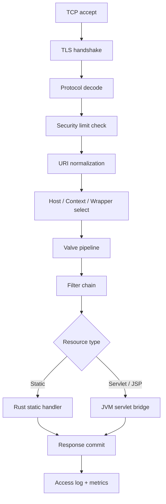

# Architecture

This document expands on the architecture summary in the README. It describes
the component model, the request flow, the lifecycle state machine, and the
startup ordering.

## The hybrid model in one sentence

The Rust runtime owns everything from the socket up to the point where
application code must run; the embedded JVM owns Servlet, JSP, EL, and
WebSocket *application* execution, reached through the
`tomcatrs-servlet-bridge` JNI bridge.

## Component model

Tomcat-RS mirrors the Apache Tomcat component hierarchy. Each level is a
lifecycle-managed component that contains the level below it:

```
Server                  process-level container; owns the shutdown port
└── Service             binds one set of Connectors to one Engine
    ├── Connector(s)    Coyote endpoints: HTTP/1.1, HTTP/2, AJP
    └── Engine          the top-level request-processing container
        └── Host        a virtual host (e.g. "localhost"); owns an appBase
            └── Context  a deployed web application (one WAR / directory)
                └── Wrapper  a single servlet within a Context
```

- **Server** — the outermost container. There is one per process. It listens
  on the shutdown port and owns one or more Services.
- **Service** — groups a set of Connectors with exactly one Engine, so traffic
  arriving on any of those Connectors is processed by the same Engine.
- **Connector** — a Coyote endpoint. It accepts connections, decodes a wire
  protocol into a normalized request, and writes the response back.
- **Engine** — the top of the request-processing pipeline. It selects a Host.
- **Host** — a virtual host. It owns an `appBase` directory and the Contexts
  deployed under it, and is the unit of auto-deploy.
- **Context** — one web application. It owns the `web.xml`-derived
  configuration, the filter chain, the session manager binding, and its
  Wrappers.
- **Wrapper** — wraps a single servlet definition and manages its
  load-on-startup and per-servlet lifecycle.

Each component implements the lifecycle trait from `tomcatrs-core`, so the
whole tree can be initialized, started, stopped, and destroyed uniformly.

## Request flow

A request travels through the following stages. Stages up to and including the
valve pipeline run in Rust; servlet invocation crosses into the JVM.

1. **TCP accept** — the Connector's accept loop takes a new connection.
2. **TLS** *(scaffolded)* — if the Connector is TLS-enabled, the handshake and
   record layer run here before any HTTP bytes are seen.
3. **Protocol decode** — the Coyote codec for the Connector's protocol
   (HTTP/1.1 today; HTTP/2 and AJP scaffolded) parses the wire bytes into a
   request line, headers, and a body stream.
4. **Limit check** — `tomcatrs-security` enforces caps: maximum header count
   and size, maximum request line length, maximum request body size, multipart
   limits. Violations are rejected before any routing happens.
5. **URI normalization** — the request URI is percent-decoded and normalized;
   path-traversal sequences and encoded path separators are detected and
   rejected. This produces a safe, canonical path for mapping.
6. **Host / Context / Wrapper selection** — the mapper in `tomcatrs-catalina`
   walks the component tree: it picks a Host from the `Host` header, the
   longest-prefix Context from the normalized path, and the Wrapper (servlet)
   from the Context's mappings.
7. **Valve pipeline** — the request passes through the Engine, Host, and
   Context valve pipelines in order. Valves are Rust-side interceptors
   (access logging, error reporting, and similar cross-cutting concerns).
8. **Filter chain** — the Context's `web.xml`-declared filter chain runs.
   Filters are application code and execute on the JVM side via the bridge.
9. **Servlet invocation** — the resolved Wrapper's servlet is invoked. For a
   static resource, the request is instead handed to the Rust static resource
   handler and never crosses into the JVM. For a JSP, the request is routed
   through the Jasper bridge.
10. **Response commit** — the response status, headers, and body are written
    back through the Connector's codec to the client.
11. **Access log / metrics** — once the response is committed, the
    observability crate records the access log entry and updates metrics.



## Lifecycle state machine

Every lifecycle-managed component moves through the following states:

```
New ──▶ Initialized ──▶ Starting ──▶ Started
                                       │
                                       ▼
                                   Stopping ──▶ Stopped ──▶ Destroyed

Any transitional step may instead enter ──▶ Failed
```

- **New** — the component object exists but nothing has been done with it.
- **Initialized** — `init()` has completed; configuration is bound, resources
  are reserved, but no work is accepted yet.
- **Starting** — `start()` is in progress; child components are being started.
- **Started** — fully operational; the component is accepting and processing
  work.
- **Stopping** — `stop()` is in progress; children are being stopped and
  in-flight work is being drained.
- **Stopped** — no longer processing work, but still initialized and
  restartable.
- **Destroyed** — `destroy()` has completed; resources are released and the
  component cannot be reused.
- **Failed** — a transition raised an unrecoverable error. A failed component
  can be inspected and destroyed but not started.

Transitions are one-directional except that a `Stopped` component may be
started again (back to `Starting` → `Started`).

## Startup ordering

Startup is **outside-in for initialization and inside-out for readiness**: a
parent initializes before its children, but a parent is only considered
`Started` once its children are started.

1. The CLI (`tomcatrs run`) loads and validates `server.xml` via
   `tomcatrs-config`, producing the component tree.
2. The **Server** is initialized, then each **Service**.
3. Within a Service, the **Engine** is initialized, then each **Host**, then
   each **Context** discovered under the Host's `appBase`, then each
   **Wrapper** within a Context.
4. If the `jvm` feature is enabled, the embedded JVM is booted during Context
   initialization and per-webapp classloaders are created before Wrappers are
   wired.
5. Components are then started in the same order. **Connectors are started
   last**, after the Engine/Host/Context/Wrapper tree is fully `Started`, so
   that no request can be accepted before there is something ready to serve it.
6. The deployment watcher begins monitoring each Host's `appBase` once the Host
   is `Started`.

Shutdown reverses this: Connectors stop first (no new requests), in-flight
requests drain, then the container tree stops inside-out, then the JVM is shut
down, then components are destroyed.
